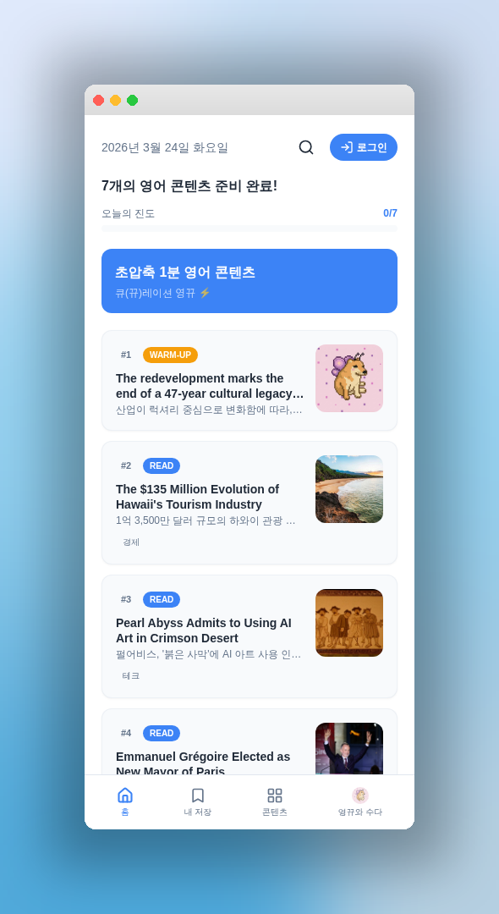
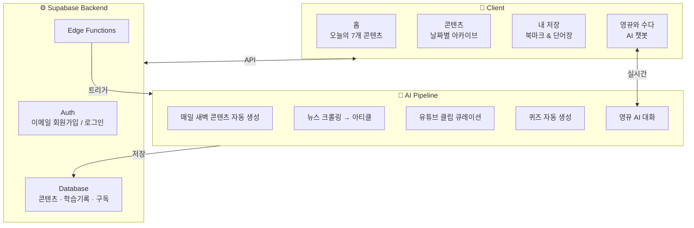

<div align="center">

# 🐕 영뀨 (YoungKku)

**초압축 1분 영어 콘텐츠 큐(뀨)레이션**

매일 엄선된 영어 콘텐츠로 1분 만에 영어 감각을 깨우세요!

[](https://daily-english-routine.lovable.app)
[]()

<br />



</div>

<br />

## 💡 소개

**영뀨**는 바쁜 일상 속에서도 매일 1분이면 영어 감각을 유지할 수 있도록 설계된 모바일 퍼스트 영어 학습 웹앱입니다. AI가 매일 새벽 자동으로 생성하는 맞춤 콘텐츠를 통해, 별도의 시간 투자 없이도 꾸준한 영어 학습이 가능합니다.

<br />

## ✨ 주요 기능

| 기능 | 설명 |
|------|------|
| 🔤 **WARM-UP** | 오늘의 핵심 영어 문장으로 하루를 시작 |
| 📰 **READ** | 실시간 뉴스 기반 영어 아티클 (영-한 병렬 표시) |
| 🎬 **WATCH** | 유튜브 인터뷰 클립으로 리스닝 훈련 |
| 📝 **QUIZ** | 학습한 표현을 퀴즈로 즉시 복습 |
| 🐕 **영뀨와 수다** | AI 시바견 캐릭터와 영어로 실시간 대화 |
| 📚 **단어장** | 학습 중 탭 한 번으로 단어 저장 & 복습 |
| 📅 **지난 콘텐츠** | 프리미엄 유저 전용 과거 콘텐츠 아카이브 |

<br />

## 🏗️ 시스템 아키텍처



```
요약 흐름:  사용자 → React SPA → Supabase Edge Functions → AI(GPT-5/Gemini) → DB → 사용자
```

<br />

## 🛠️ 기술 스택

<div align="center">


</div>

| 영역 | 기술 |
|------|------|
| **Frontend** | React 18, TypeScript, Vite, Tailwind CSS, shadcn/ui |
| **Backend** | Supabase (Auth, Database, Edge Functions) |
| **AI** | GPT-5, Gemini — 콘텐츠 자동 생성 & 챗봇 |
| **State** | TanStack Query (React Query) |
| **Routing** | React Router v6 |
| **UI/UX** | 모바일 퍼스트 반응형 디자인 |

<br />

## 💰 요금제

| | 무료 | 프리미엄 (₩9,900/월) |
|------|:---:|:---:|
| 오늘의 콘텐츠 | ✅ | ✅ |
| 영뀨와 수다 | 하루 3회 | 하루 100회 |
| 지난 콘텐츠 | ❌ | ✅ |
| 단어장 & 북마크 | ✅ (로그인 필요) | ✅ |

<br />

## 🔗 링크

- 🐕 **영뀨 바로가기**: [daily-english-routine.lovable.app](https://daily-english-routine.lovable.app)

---

<div align="center">

**Made with ❤️ by [tm_uchal]**

</div>
